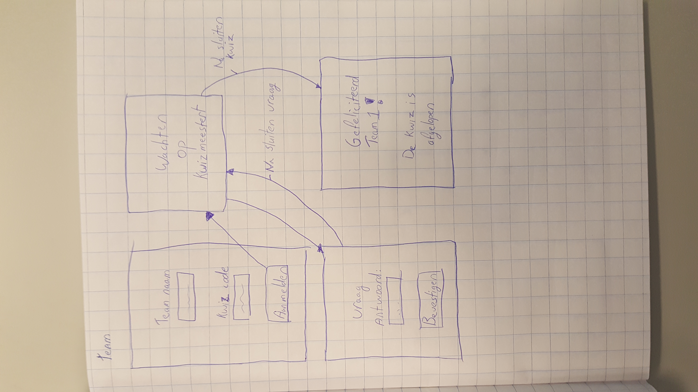
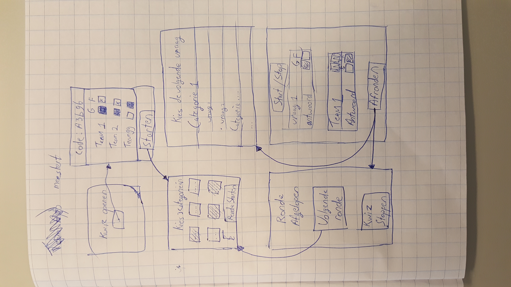
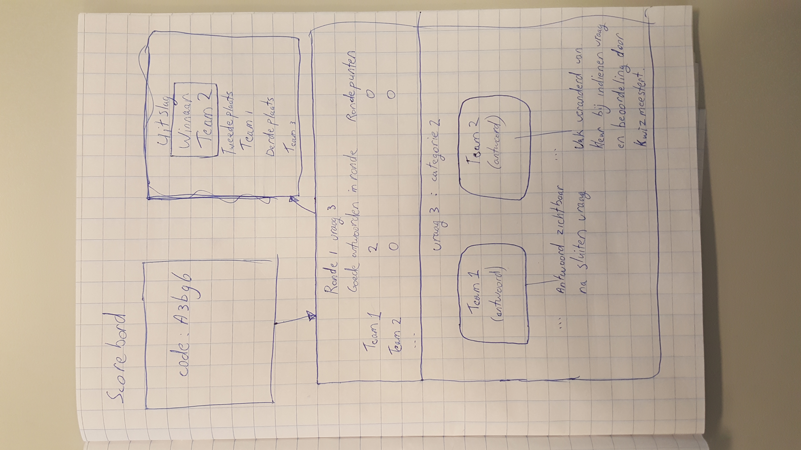

# Kwizzert
**KWIZ BEHEER API CALLS MOGEN ALLEEN ALS MEESTERT IS INGELOGD.(IETS MET SESSIONS)**

## Mappen structuur
Hieronder staat de mappen structuur van Kwizzert.
```
Kwizzert/
    team/
        build/
        node_modules/
        public/
        src/
        package.json
    kwizmeestert/
        build/
        node_modules/
        public/
        src/
        package.json
    scorebord/
        build/
        node_modules/
        public/
        src/
        package.json
    .gitignore
    LICENSE
    package.json
    README.md
```
## Mockups
Hieronder zijn de functionaliteiten weergegeven die ondersteund worden door de verschillende apps.

### Team-app
- Aanmelden
- Huidige vraag weergeven
- Vraag beantwoorden

Teams moeten zich kunnen aanmelden via het eerste scherm. Daarna moeten de teams op de kwizmeestert wachten, wanneer hij een vraag start wordt de vraag getoond met een veld voor een antwoord. Als extra is er een scherm bedacht die wordt getoond wanneer de kwiz wordt gesloten, dan krijgen de teams een bericht waarin staat hoe goed ze de kwiz hebben gemaakt.



### KwizMeestert-app
- Openstellen voor aanmeldingen
- Aanmeldingen goedkeuren
- Kwiz starten
- Ronde starten
- Categorieën kiezen
- Kwiz afsluiten
- Vraag kiezen
- Vraag starten
- Vraag sluiten
- Antwoord goedkeuren

De kwizmeestert kan in het eerste scherm een kwiz openstellen voor aanmeldingen, daarna kunnen teams zich aanmelden en kan de kwizmeestert teams toelaten of afwijzen.
De kwizmeestert moet na het starten van een kwiz drie categorieën selecteren om de ronde te starten. De kwizmeestert dan voorgaand aan iedere vraag een vraag kiezen uit de geselecteerde categorieën. De kwizmeestert bepaald bij iedere vraag hoelang teams een antwoord kunnen indienen. De kwizmeestert kan ook antwoorden van teams goedkeuren.
Als er 12 vragen zijn geweest kan de kwizmeestert kiezen om een nieuwe ronde te starten of om de kwiz te stoppen.



### Scorebord-app
- Voortgang weergeven
- Rondepunten weergeven
- Goede antwoorden per team in huidige ronde
- Als een vraag loopt:
  - geef vraag weer
  - geef categorie weer
  - geef huidige teamstatus weer
- Als er geen vraag loopt:
  - geef antwoorden per team weer
  - geef beoordeling kwizmeestert weer
  - werk teamscores bij
  
Het scorebord app geeft de voortgang van de kwiz weer. Er moet worden getoond welke teams meedoen, hoeveel vragen iederen team goed heeft en het aantal rondepunten. Daarnaast geeft het scorebord bij iedere vraag live weer welke teams een antwoord hebben ingedient. Wanneer de vraag is gesloten is op het scorebord live te zien of de kwizmeestert een antwoord heeft goedkeurd of afgekeurd.


  
## Technische specificatie
Hieronder staat per onderdeel van de applicatie(clients en server) beschreven van welke technologieën gebruik wordt gemaakt.

### Clients
Alle clients maken gebruikt van react en redux. Communicatie tussen clients zal via websockets gaan, superagent wordt gebruikt om AJAX calls te doen naar de server.

### Server
Op de server wordt express gebruikt voor de routing van de client apps en de REST API. De REST API wordt vooral gebruikt om data uit de database te verzenden. Op de server zal ook een MongoDB draaien waarin vragen, categorieën en antwoorden staan.

## Routing
De index pagina toont een statische pagina met drie knoppen.Deze knoppen verwijzen naar de verschillende applicaties.

### Team-app
/team

### KwizMeestert-app
/kwizmeestert

### Scorebord-app
/scorebord

## Communicatie
Er is gekozen om de communicatie tussen de verschillende onderdelen van Kwizzert af te handelen via websocket en een API. Alle communicatie met de database gaat via een API op de server, alle overige communicatie gaat via websockets.

### API
##### POST /api/v1/login
De meestert moet zich authenticeren via een sessionId.  
**Dit moet via een HTTP header gebeuren maar wij weten nog niet hoe.**

```
Body parameters:
{
    password: "..."
}

Response 
    success: 200 OK
    failed : 401 Unauthorized
```

#### Kwiz
##### GET /api/v1/kwiz/create
Maakt een nieuwe Kwiz aan en geeft de unieke Kwiz code terug.  
*Hiervoor moet een session aangemaakt zijn door middel van /api/v1/login.*
```
Response:
{
    code: "..."
}
```

##### GET /api/v1/kwiz/:code
Voordat clients zich bij een kwiz aanmelden moet er worden gecontroleerd of de kwiz bestaat, als de kwiz niet bestaat wordt _null_ gegeven, als de kwiz gestart of gestopt is wordt open of closed gegeven.
```
Response:
{
    status: null | open | closed
}
```

#### Categories
##### GET /api/v1/categories
Vraag een lijst op met alle categorieën.
```
Response:
[
    { categoryName: "..." },
    { ... }
]
```

#### Questions
##### GET /api/v1/questions
Vraag een lijst op van alle vragen in gegeven categorie.  
*Hiervoor moet een session aangemaakt zijn door middel van /api/v1/login.*
```
Query parameters
    categoryName: Naam van de categorie. (required)

Response:
[
    { 
        _id: "...",
        question: "...",
        answer: "...",
        category: "..."
    },
    { ... }
]
```

##### GET /api/v1/kwizmeestert-questions/:id
Vraag alle informatie over een vraag op.  
*Hiervoor moet een session aangemaakt zijn door middel van /api/v1/login.*
```
Response:
{
    question: "...",
    answer: "...",
    category: "..."
}
```

##### GET /api/v1/questions/:id
Vraag een vraag op.
```
Response:
{
    question: "...",
    category: "..."
}
```

### Websocket
##### Client identificeren
Elke client moet aangeven wat zijn rol is: kwizmeestert, team of scorebord. 
```
{
    action: "REGISTER",
    code: "...",
    type: "quizmaster | team | scoreboard"
}
```

##### Team aanmelden
Een team kan zich aanmelden voor een kwiz.
```
{
    action: "ADD_TEAM",
    code: "...",
    teamName: "..."
}
```

##### Kwizmeestert start een kwiz
Een kwizmeestert bepaald welke teams meedoen en start de kwiz met deze teams.
```
{
    action: "START_QUIZ",
    code: "...",
    teams: [
        {
            teamName: "...",
            allowed: true | false
        },
        { ... }
    ]
}
```

##### Kwizmeestert kiest een vraag
Een kwizmeestert kiest een vraag, de andere clients halen de vraag op.
```
{
    action: "PICK_QUESTION",
    code: "...",
    questionId: "..."
}
```

##### Kwizmeestert start een vraag
Een kwizmeestert start een vraag.
```
{
    action: "START_QUESTION",
    code: "..."
}
```

##### Kwizmeestert sluit een vraag
Een kwizmeestert sluit een vraag.
```
{
    action: "CLOSE_QUESTION",
    code: "..."
}
```

##### Kwizmeestert beoordeeld een antwoord
De kwizmeestert keurt vragen goed of fout.
```
{
    action: "RATE_ANSWER",
    code: "...",
    answers: [
        {
            team: "...",
            answer: "...",
            approved: true | false
        }
    ]
}
```

##### Ronde afgelopen
Een kwizmeestert sluit een ronde.
```
{
    action: "ROUND_FINISHED",
    code: "..."
}
```

##### Kwiz afgelopen
Een kwizmeestert beëindigd een kwiz.
```
{
    action: "QUIZ_FINISHED",
    code: "..."
}
```
